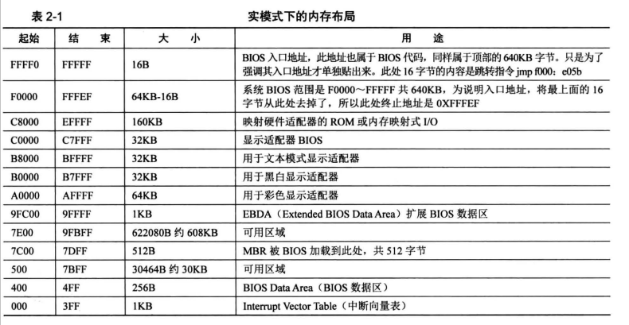

<!--
 * @Author: leeloonki
 * @Date: 2023-02-21 17:12:42
 * @LastEditTime: 2023-02-21 21:31:30
 * @LastEditors: leeloonki
 * @Description: 回顾本项目、梳理相关知识
 * @FilePath: \mini_unix_like_OS\00二周目\note.md
-->

操作系统是什么？如何控制硬件？
* 操作系统是管理资源的软件，操作系统能做什么取决于主机上硬件的功能。硬件提供软件方面的接口，通过参考硬件手册编写软件(驱动程序)，控制硬件。

CPU访问外部硬件的方式：
* 地址映射：将外设的内存映射到CPU可寻址的地址空间，CPU通过地址总线访问该内存区域时会访问外设的内存。如显卡与显存。 
* 通过IO接口：IO接口与外设信息交互。

如何访问IO接口？
* 通过访问端口。

C运行时库CRT：
编译器提供一套库函数，库函数封装系统调用，库函数集合称为运行库。
$$
\begin{aligned}
    &通常：用户程序 \rarr CRT \rarr 系统调用 \\
    &也可：用户程序 \rarr 系统调用
\end{aligned}
$$

编译器与宿主操作系统：
* 编译器对不同系统有不同实现。

程序为什么分段？

* 分段是内存访问技术。
* 遗留问题，CPU8086开始，CPU和寄存器都是16位，那时计算机没虚拟地址，访问任何存储单元都是物理地址。在以绝对物理地址访问内存的CPU运行程序，程序中指令地址为绝对物理地址，程序必须放在固定位置，对于这一问题，让CPU采用段基址+段内偏移地址访问任意内存。
* 重定位：加载用户程序时，只要将整个段的内容复制到新的位置，再将段基址寄存器中的地址改成该地址，程序便可准确无误地运行，因为程序中用的是段内偏移地址，相对于新的段基址，该偏移地址处的内存内容还是一样的。
* 当时内存有1MB而16位寄存器只能访问64K，为了访问全部的20位地址，CPU设计者采用`段基址<<4 + 段内偏移`，得到20位地址。

在CPU的内存访问机制中处理器使用硬件-段寄存器，指向软件-程序代码中用section或segment以软件形式定义的内存段。
编译器将程序划分为代码段和数据段，如编译器gcc会将c语言写出的程序划分为代码段、数据段、栈段、堆、bss段。操作系统将这些编译出的段分配到不同的物理内存。使用命令`readelf -e elf`可查看段类型。

代码段、数据段的访问权限是如何实现的?
1. 编译器将程序片段分类为只读代码段、读写数据段。
2. 操作系统通过设置GDT全局描述符表构建段描述符(数据结构)，在段描述符中指定段的位置，大小、属性。
3. CPU的段寄存器被操作系统赋予相应的段选择子，确定当前访问的段，执行指令时，根据段的属性判断指令行为。
   

CPU工作模式
* 32位CPU有实模式、保护模式两种工作模式。

大端小端：
* 多字节数组如何在内存中存放。

Bios：
每个外设，显卡、键盘、控制器都有自己的内存，主板也有内存，Bios存放在其中。硬件的功能调用例程以及初始化代码存放在ROM内存中。从内存的物理地址 OxAOOOO 开始到 OxFFFFF 这部分内存中， 部分是专门用来做映射的，如果硬件存在，硬件自己的 ROM 会被映射到这片内存中的某处。
BIOS 在运行期间会扫描 OxCOOOO OxEOOOO 之间的内存，若在某个区域发现前两个
节是 Ox55 OxAA 时，这意味着该区域对应的 rom 中有代码存在，再对该区域做累加和检查，若结果与第个字节的值相符，说明代码无误，就从第 个字节进入。这时开始执行了硬件自带的例程以初始化硬件自身，最后， BIOS 填写中断向量表中相关项，使它们指向硬件自带的例程。

操作系统启动流程：
* bios -> mbr
* mbr是主引导记录，存在于整个硬盘最开始的那个扇区，0盘0磁道1扇区，该扇区称为mbr引导扇区。通常一个扇区512B
BIOS将mbr扇区加载到物理内存0x7c00，然后跳过去执行mbr程序。
mbr中有4个分区，每个分区16字节，各分区都可能有os，在分区时，若想在指定分区安装os，可将16字节中的活动标记位设为0x80，mbr将cpu使用权交给该分区的引导程序即内核加载器。

mbr引导扇区的内容：
* 446字节引导程序、参数
* 64字节分区表
* 2字节结束标记

含内核加载器的分区的起始扇区称为OS引导扇区，也成为OBR，OBR前三个字节存放跳转指令，MBR跳转到OBR引导扇区的起始处，该起始处跳转指令又跳转到内核。

NASM：
* 为可移植模块化的80x86汇编器。支持
Linux平台。

bochs：
* x86模拟器，支持处理器(包括保护模式)、内存、硬盘、显示器、以太网、Bios硬件外设仿真。

实模式内存：

地址0-0x9ffff是dram即物理内存。

dd：

* 磁盘操作命令

实模式与保护模式区别：

实模式中使用真正的物理地址，保护模式虚拟地址。

实模式无特权级，可访问任意物理内存，包括OS内存数据，不安全。

