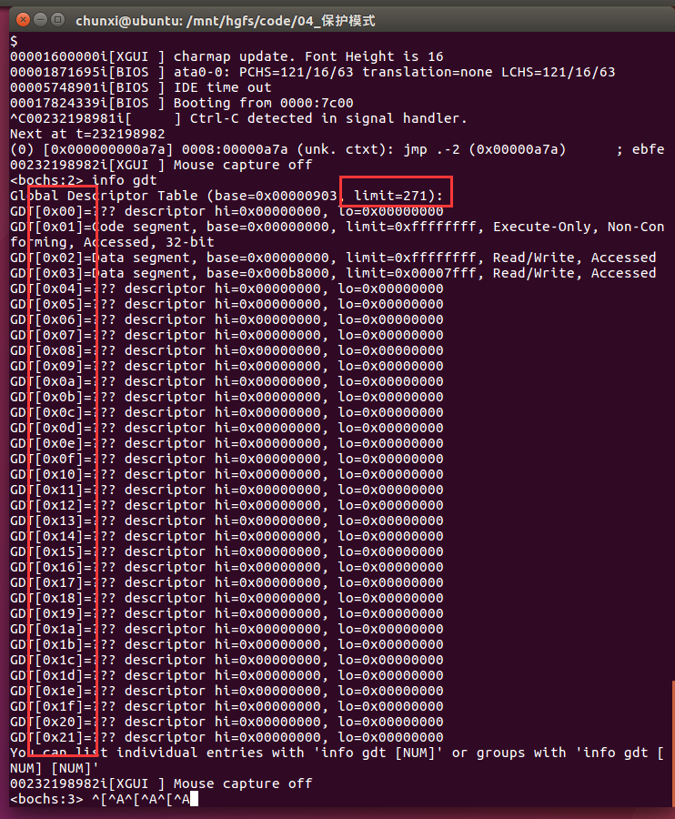
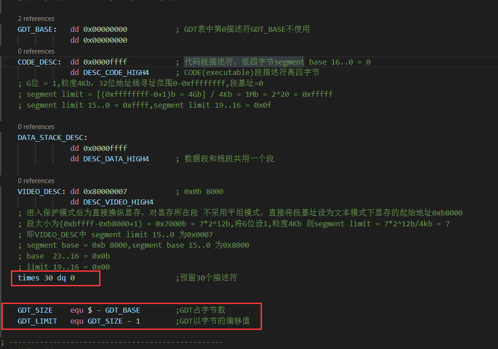
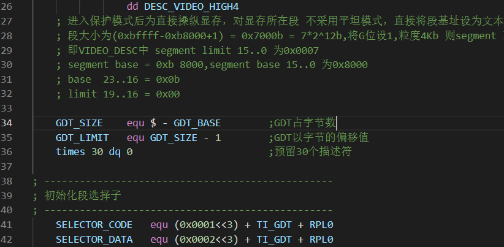
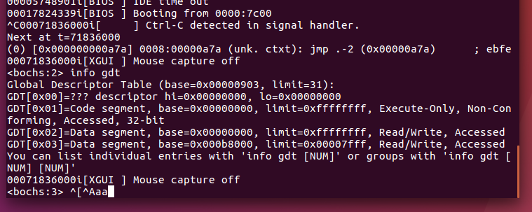

使用bochs调试时

info gdt 指令

输出 limit 和表项 271 和 0x21

程序中time 30 dq 0将预留的30个描述符写在GDT_SIZE 和 GDT_LIMIT中，因此会影响输出的GDT表项的个数

GDT我们定义了4个预留30个，34* 8 = 272 

共34 = 0x22个表项。 GDT[0] - GDT[0x21]

交换位置后

重新编译运行

此时只有4个表项
